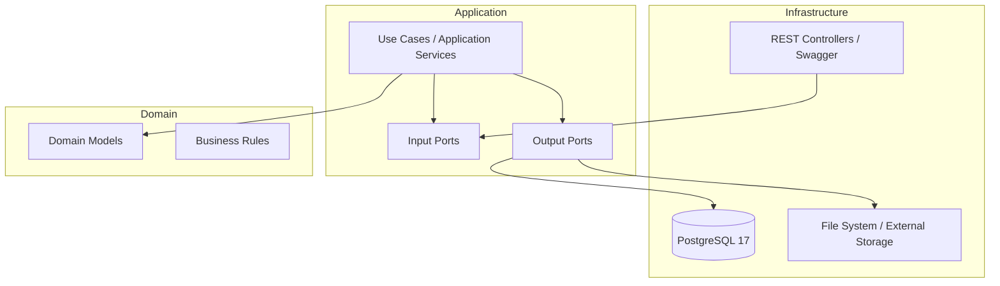
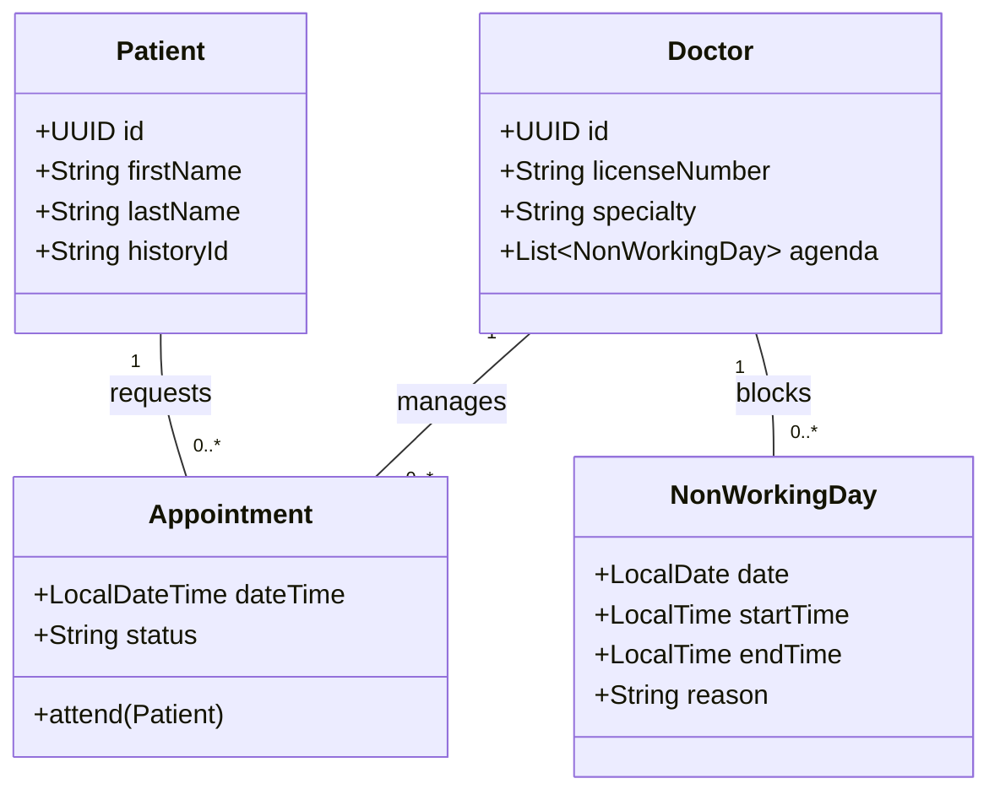

# 🏥 Clinic Management System  
### Fullstack Enterprise Healthcare Platform

Un **sistema integral de gestión clínica**, diseñado con enfoque **enterprise-grade**, priorizando **escalabilidad, mantenibilidad y desacoplamiento real**.  
El proyecto aplica **Arquitectura Hexagonal (Ports & Adapters)** en el backend y una **UI moderna de alto rendimiento** en React.

> 📌 **Objetivo del proyecto:** demostrar dominio de **arquitectura limpia**, **diseño orientado al dominio (DDD)** y **buenas prácticas profesionales** aplicadas a un sistema real del sector salud.

---

## 🧠 Arquitectura — Clean, Hexagonal & Scalable

El backend está diseñado para **proteger el dominio** de cualquier cambio tecnológico, garantizando independencia de frameworks, bases de datos y UI.

✔ Beneficios clave

• Dominio 100 % independiente

• Testing de casos de uso sin frameworks

• Sustitución de DB / UI sin impacto en negocio

• Escalabilidad y evolución a largo plazo

#📊 Modelo de Dominio (UML)

##Relación entre las entidades principales del sistema clínico:

| Layer            | Technologies                       | Purpose                      |
| ---------------- | ---------------------------------- | ---------------------------- |
| **Backend**      | Java 17+, Spring Boot 3.4          | REST API & Application Core  |
| **Persistence**  | JPA, Hibernate, PostgreSQL 17      | Relational data integrity    |
| **Frontend**     | React 18, Vite                     | High-performance UI          |
| **Architecture** | Hexagonal, Clean Architecture, DDD | Enterprise design            |
| **Tooling**      | MapStruct, Lombok, Swagger         | Productivity & documentation |

#🧱 Project Structure (Hexagonal)

src/main/java/com/project/project/
├── application/          # Use cases & orchestration
│   ├── dto/              # Commands / Results
│   ├── mapper/           # Application ↔ Domain mapping
│   └── useCase/          # Business workflows
├── domain/               # Pure business logic
│   ├── model/            # Domain entities
│   └── port/             # Input / Output ports
├── infrastructure/       # Frameworks & adapters
│   ├── input/            # REST controllers
│   └── output/           # JPA repositories, DB, external systems
└── shared/               # Cross-cutting concerns

#💡 Key Features
##✅ Implemented

Smart Appointment Scheduling
Prevents overlapping appointments automatically.

Non-Working Days Management
Doctors can block full days or specific time ranges.

Digital Medical Records
Patient history with file attachments.

Clean Separation of Concerns
Strict architectural boundaries enforced.

##🚧 In Progress

Enterprise Security
JWT authentication + Role-Based Access Control (RBAC).

#⚙️ Configuration & Run
##🔧 Requirements

• Java JDK 17+

• Maven 3.9+

• PostgreSQL 17

#🗄️ Database Configuration

spring.datasource.url=jdbc:postgresql://localhost:5432/postgres?currentSchema=public
spring.datasource.username=postgres
spring.datasource.password=postgres

spring.jpa.hibernate.ddl-auto=update
spring.jpa.show-sql=true

#▶️ Run Application

mvn clean install
mvn spring-boot:run

#👨‍💻 Author

##Alejandro Ahmad
##Future Information Systems Engineer

##📩 Email: yafarahmad72@gmail.com

##🐙 GitHub: https://github.com/Yafar12

© 2025 Clinic Management System
Professional software engineering applied to healthcare
