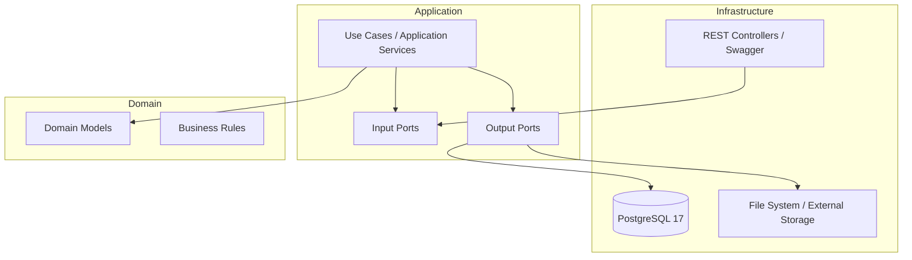

# 🏥 Clinic Management System
### Fullstack Enterprise Healthcare Platform

    

Un **sistema integral de gestión clínica**, diseñado con enfoque **enterprise-grade**, priorizando la **escalabilidad, mantenibilidad y desacoplamiento real**. El proyecto aplica **Arquitectura Hexagonal (Ports & Adapters)** en el backend y una **UI moderna de alto rendimiento** en React con Vite.

> 📌 **Objetivo del proyecto:** Demostrar el dominio de **arquitectura limpia**, **diseño orientado al dominio (DDD)** y **buenas prácticas profesionales** aplicadas a un sistema real del sector salud.

---

## 🧠 Arquitectura — Clean, Hexagonal & Scalable

El backend está diseñado para **proteger el dominio** de cualquier cambio tecnológico, garantizando independencia de frameworks, bases de datos y UI.

✔️ Beneficios claveDominio independiente: El núcleo no conoce la base de datos ni la web.Testing puro: Capacidad de testear casos de uso sin dependencias pesadas.Flexibilidad: Sustitución de base de datos o UI con mínimo impacto.📊 Modelo de Dominio (UML)Relación entre las entidades principales del sistema clínico:Fragmento de códigoclassDiagram

    class Patient {
        +UUID id
        +String firstName
        +String lastName
        +String historyId
    }

    class Doctor {
        +UUID id
        +String licenseNumber
        +String specialty
        +List~NonWorkingDay~ agenda
    }

    class Appointment {
        +LocalDateTime dateTime
        +String status
        +attend(Patient)
    }

    class NonWorkingDay {
        +LocalDate date
        +LocalTime startTime
        +LocalTime endTime
        +String reason
    }

    Doctor "1" -- "0..*" Appointment : manages
    Patient "1" -- "0..*" Appointment : requests
    Doctor "1" -- "0..*" NonWorkingDay : blocks
    
🚀 Tech Stack

| Layer            | Technologies                       | Purpose                      |
| ---------------- | ---------------------------------- | ---------------------------- |
| **Backend**      | Java 17+, Spring Boot 3.4          | REST API & Application Core  |
| **Persistence**  | JPA, Hibernate, PostgreSQL 17      | Relational data integrity    |
| **Frontend**     | React 18, Vite                     | High-performance UI          |
| **Architecture** | Hexagonal, Clean Architecture, DDD | Enterprise design            |
| **Tooling**      | MapStruct, Lombok, Swagger         | Productivity & documentation |

🧱 Project Structure (Hexagonal)

├── application/          # Casos de uso y orquestación
│   ├── dto/              # Commands / Results
│   ├── mapper/           # Mapeo Aplicación ↔ Dominio
│   ├── useCase/          # Workflows de negocio
│   ├── GuestCreator.java # Puerto de entrada
│   └── GuestFindAll.java # Puerto de entrada
├── domain/               # Lógica de negocio pura (Core)
│   ├── model/            # Entidades de dominio
│   └── port/             # Puertos de salida (Interfaces)
├── infrastructure/       # Frameworks y adaptadores
│   ├── input/            # Controladores REST (Input Adapters)
│   └── output/           # Repositorios JPA y storage (Output Adapters)
└── shared/               # Recursos transversales (Configuración, Errores)

💡 Funcionalidades Clave✅ 

ImplementadasSmart Appointment Scheduling: Previene automáticamente el solapamiento de citas.
Non-Working Days Management: Gestión de bloqueos de agenda por médicos.
Digital Medical Records: Historial de pacientes con soporte para archivos.
Global Exception Handling: Manejo centralizado de errores con códigos de dominio.
Enterprise Security: Autenticación JWT + Role-Based Access Control (RBAC).

🚧 En Progreso

⚙️ Configuración y Ejecución
🗄️ Base de DatosConfigura 

src/main/resources/application.properties:Propertiesspring.datasource.url=jdbc:postgresql://localhost:5432/postgres?currentSchema=public
spring.datasource.username=postgres
spring.datasource.password=postgres
spring.jpa.hibernate.ddl-auto=update

▶️ Correr AplicaciónBashmvn

clean install
mvn spring-boot:run
👨‍💻 Autor
Alejandro Ahmad Futuro Ingeniero en Sistemas de Información
📩 Email: yafarahmad72@gmail.com
🐙 GitHub: Yafar12© 2025 Clinic Management System
Professional software engineering applied to healthcare.
