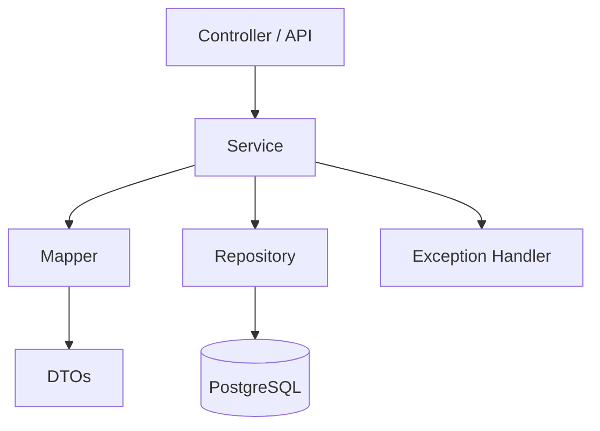
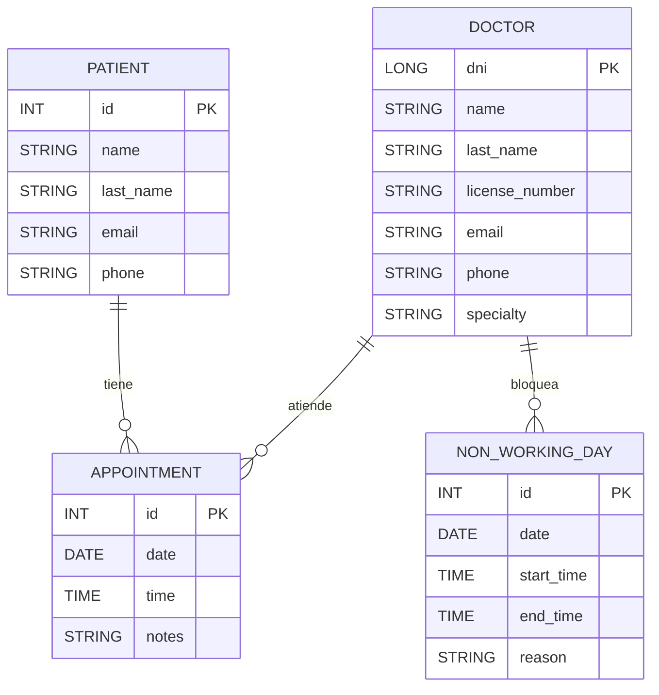

# Clinic System – Backend

    

> **Autor:** **Alejandro Ahmad** — *Futuro Ingeniero en Sistemas de Información*

Sistema de gestión para clínicas/hospitales desarrollado en **Java + Spring Boot**, con **Spring Data JPA/Hibernate** y **PostgreSQL**. Aplica **arquitectura en capas**, **principios SOLID**, **patrones (DTO, Repository, Service, Mapper manual, Exception Handler)** y **buenas prácticas**.

---

## 📌 Características clave

* CRUD de entidades principales (p. ej., **Doctor**, **Patient**, **Appointment**, **NonWorkingDay**).
* **DTOs** para Requests/Responses y **mappers manuales** (sin magia, control total).
* Validaciones con `jakarta.validation`.
* Manejo uniforme de errores (Handler global + códigos y mensajes claros).
* Documentación con **OpenAPI/Swagger UI**.
* Preparado para **PostgreSQL** local o en contenedor.

> *Nota:* Algunas entidades/funcionalidades pueden estar en progreso.

---

## 🧱 Arquitectura (Capas)



* **Controller**: expone endpoints REST, valida entrada básica.
* **Service**: reglas de negocio, transacciones, orquestación.
* **Repository**: persistencia con Spring Data JPA.
* **Mapper manual**: transforma `Entity ↔ DTO` explícitamente.
* **Exception Handler**: respuestas homogéneas de error.

---

## 🗃️ Modelo (ER simplificado)



---

## 🗂️ Estructura del proyecto

```text
Clinic-system/
└─ system/                      # módulo backend
   ├─ src/main/java/com/clinic/system/
   │  ├─ controllers/           # REST Controllers
   │  ├─ dto/
   │  │  ├─ doctor/ patient/ appointment/ nonWorkingDay/
   │  │  └─ mapper/             # mappers manuales
   │  ├─ exceptions/            # AppException + handler global
   │  ├─ helpers/               # helpers (e.g., DoctorRefMapper)
   │  ├─ model/                 # entidades JPA
   │  └─ repository/ service/   # repos + servicios
   ├─ src/main/resources/
   │  ├─ application.properties
   │  └─ application-local.properties (gitignored)
   └─ build.gradle / settings.gradle
```

---

## 🚀 Ejecución local

### Requisitos

* **JDK 21+**
* **PostgreSQL 15/16/17** (usuario/DB locales)
* **Gradle Wrapper** incluido (`./gradlew`)

### Configurar base de datos

1. Crear DB y usuario (ejemplo):

   ```sql
   CREATE DATABASE clinic_db;
   CREATE USER clinic_user WITH PASSWORD 'StrongPassword!';
   GRANT ALL PRIVILEGES ON DATABASE clinic_db TO clinic_user;
   ```
2. Ajustar `src/main/resources/application.properties` o crear `application-local.properties` (recomendado y **gitignored**):

   ```properties
   spring.datasource.url=jdbc:postgresql://localhost:5432/clinic_db
   spring.datasource.username=clinic_user
   spring.datasource.password=StrongPassword!

   spring.jpa.hibernate.ddl-auto=update
   spring.jpa.show-sql=true
   spring.jpa.properties.hibernate.format_sql=true

   # Perfil local
   spring.profiles.active=local
   ```

### Correr la app

```bash
# Unix
./gradlew bootRun --args='--spring.profiles.active=local'

# Windows (PowerShell)
./gradlew.bat bootRun --args="--spring.profiles.active=local"
```

### Build

```bash
./gradlew clean build
```

Genera `system/build/libs/*.jar`.

---

## 🐘 Docker (opcional para PostgreSQL)

```yaml
# docker-compose.yml
version: "3.9"
services:
  db:
    image: postgres:17
    environment:
      POSTGRES_DB: clinic_db
      POSTGRES_USER: clinic_user
      POSTGRES_PASSWORD: StrongPassword!
    ports:
      - "5432:5432"
    volumes:
      - pgdata:/var/lib/postgresql/data
volumes:
  pgdata:
```

Levantar:

```bash
docker compose up -d
```

---

## 📖 API Docs (Swagger)

Una vez arriba, visitar:

```
http://localhost:8080/swagger-ui/index.html
```

---

## 🔌 Endpoints (muestra)

> Los paths pueden variar según tu `@RequestMapping`.

**Doctors**

* `POST /api/doctors` — crear doctor
* `GET /api/doctors/{dni}` — obtener por DNI
* `PUT /api/doctors/{dni}` — actualizar datos (parcial)
* `GET /api/doctors` — listar

**Non Working Days**

* `POST /api/non-working-days` — crear bloqueo
* `PATCH /api/non-working-days/{id}/reason` — actualizar motivo
* `GET /api/non-working-days?doctorDni=...` — listar por doctor

### Ejemplo de `DoctorResponse`

```json
{
  "DNI": 12345678,
  "full_name": "Ana Pérez",
  "license_number": "MP-001122",
  "email": "ana@clinic.com",
  "phone": "+54-381-555-0000",
  "specialty": "CARDIOLOGY"
}
```

### Ejemplo de `NonWorkingCreateRequest`

```json
{
  "dni": 12345678,
  "date": "2025-08-25",
  "startTime": "08:00:00",
  "endTime": "12:00:00",
  "reason": "Capacitación"
}
```

---

## ✅ Buenas prácticas aplicadas

* **SOLID** y separación de responsabilidades.
* **DTOs** para exponer solo lo necesario.
* **Mapper manual**: control explícito, sin autogenerado.
* **Validación** con anotaciones (`@NotNull`, `@Email`, `@Size`, etc.).
* **Manejo de errores** uniforme (AppException + Handler global, códigos claros).
* **Reglas de negocio** en `Service`, no en controller/repository.
* **Transacciones** donde corresponda.

---

## 🧪 Tests (pendiente)

* Unit tests con **JUnit 5** y **Mockito** (planificados).
* Tests de integración con **Spring Boot Test** (planificados).

---

## 🧭 Convenciones

* **Commits:** Conventional Commits (`feat:`, `fix:`, `chore:`, `refactor:`, ...).
* **Ramas:** GitFlow simple (`main` estable, `develop` integración, `feature/*`).
* **Estilo:** formateo consistente (Spotless/Checkstyle sugeridos).

---

## 🔒 Seguridad (opcional / roadmap)

* Autenticación **JWT** y **roles**.
* Políticas CORS y rate limiting.

---

## 📅 Roadmap

* [ ] Endpoints de Appointment completos
* [ ] Paginación y filtros avanzados
* [ ] Integración con Auth (JWT)
* [ ] Tests unitarios / integración
* [ ] Dockerfile multi-stage

---

## 👤 Autor

**Alejandro Ahmad**
*Futuro Ingeniero en Sistemas de Información*

* GitHub: [https://github.com/Yafar12](https://github.com/Yafar12)
* Email: *agregar email de contacto*

---

## 📜 Licencia

© 2025 Alejandro Ahmad. Todos los derechos reservados.

> Si preferís una licencia abierta (MIT/Apache-2.0), puedo generar el archivo `LICENSE` y actualizar este apartado.
